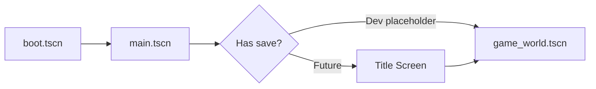

# Scene Architecture — Digital Frontier

2.5D top-down presentation uses **Node3D** for world space with an orthographic or shallow-perspective camera. UI remains **CanvasLayer**-based.

---

## Scene Categories

| Category | Path | Lifetime | Description |
|----------|------|----------|-------------|
| Bootstrap | `scenes/bootstrap/` | Transient | Boot, splash, loading screen |
| Main shell | `scenes/main/` | **Persistent** | Owns scene swapping & UI layers |
| World | `scenes/world/` | Swappable | Overworld shell, regions, buildings |
| Entities | `scenes/entities/` | Instanced | Player, NPCs, creatures, vehicles |
| Combat | `scenes/combat/` | Swappable | Boss arenas, battle instances |
| UI | `scenes/ui/` | Persistent / modal | HUD, menus, popups |
| Templates | `scenes/_templates/` | Never run directly | Copy-paste blueprints |
| Debug | `scenes/debug/` | Dev builds | Overlays, inspectors |

---

## Boot Sequence



1. **`boot.tscn`** — Minimal Node; verifies autoloads, emits `bootstrap_completed`, changes to main.
2. **`main.tscn`** — Registers containers with `SceneManager` and `UIManager`, then loads first gameplay scene.
3. Future: title screen, save slot selection, home companion screen.

---

## Main Shell (`main.tscn`)

```
Main (Node)
├── SceneContainer          ← SceneManager mounts active scene here
├── TransitionOverlay       ← ColorRect; SceneManager fades
└── UI
    ├── HUDLayer            ← CanvasLayer 10
    ├── MenuLayer           ← CanvasLayer 20
    ├── ModalLayer          ← CanvasLayer 30
    └── OverlayLayer        ← CanvasLayer 40
```

**Why persistent shell?**
- UI layers survive world transitions
- Fade overlay works across any scene change
- Autoload references stay valid (no re-registration)

---

## Game World (`game_world.tscn`)

```
GameWorld (Node3D)
├── HexGridLayer            ← Chunked tile meshes; streamed by region
├── BuildingLayer           ← Exterior building instances
├── EntityLayer             ← Player, NPCs, wild creatures
├── EffectsLayer            ← Weather, footstep dust, ambient particles
└── CameraRig (Node3D)
    └── Camera3D            ← Orthographic top-down 2.5D
```

### Layer responsibilities

| Layer | Owns | Does NOT own |
|-------|------|--------------|
| HexGridLayer | Tile meshes, ground collision | Entities, buildings |
| BuildingLayer | Exterior shells, enter triggers | Interior geometry |
| EntityLayer | CharacterBody3D instances | Tile terrain |
| EffectsLayer | GPUParticles, decals | Gameplay logic |

---

## Region Scenes (`scenes/world/regions/`)

Each region has:
- A **RegionData** resource in `data/regions/`
- A **region scene** referenced by `RegionData.scene_path`

```
StarterPlains (Node3D)
├── RegionRoot
│   ├── HexGrid              ← Populated at runtime or baked
│   └── Props                ← Static decoration
```

Regions are loaded when `EventBus.region_load_requested` fires. WorldManager validates the ID via ResourceRegistry.

---

## Building Scenes

Buildings split into **exterior** (on hex grid) and **interior** (loaded additively).

### Exterior (`scenes/world/buildings/exteriors/`)

```
VillageHallExterior (Node3D)
├── MeshRoot
├── EntranceMarker           ← Player spawn when exiting interior
└── InteractionArea (Area3D)   ← Emits building_enter_requested
```

### Interior (`scenes/world/buildings/interiors/`)

```
VillageHallInterior (Node3D)
├── NavigationRegion3D       ← NPC pathfinding
├── SpawnPoint (Marker3D)    ← Player spawn on enter
└── NPCAnchors               ← Marker3D children per NPC slot
```

**Additive loading pattern (future):**
```
GameWorld
└── InteriorContainer        ← Interior scenes parent here
    └── VillageHallInterior  ← Loaded/unloaded on enter/exit
```

---

## Entity Scenes (`scenes/entities/`)

All entities inherit structure from `_templates/entity_template.tscn`:

```
EntityTemplate (CharacterBody3D)
├── CollisionShape3D
├── VisualRoot               ← Mesh / sprite billboard
└── InteractionArea (Area3D)
    └── CollisionShape3D
```

Subfolders:
- `player/` — Player rig, camera follow (if not on GameWorld)
- `creatures/` — Overworld & battle creature visuals
- `npcs/` — NPC variants
- `vehicles/` — Mountable vehicles

**Rule:** Entity scenes read their data from `*Data` resources passed at spawn time — no hardcoded stats in scene scripts.

---

## Combat Scenes (`scenes/combat/`)

Boss and battle scenes are **self-contained arenas** swapped in via SceneManager or loaded additively:

```
BossArena (Node3D)
├── ArenaGeometry
├── BossSpawnPoint
├── PlayerSpawnPoint
└── CameraRig
```

`BossData.arena_scene_path` points here.

---

## UI Scenes (`scenes/ui/`)

```
scenes/ui/
├── hud/                     ← Always-visible gameplay UI
├── menus/                   ← Inventory, quest log, settings, title
└── components/              ← Reusable buttons, item slots, dialogue box
```

Instantiate UI scenes into the appropriate CanvasLayer registered with UIManager.

Modal flow:
1. `UIManager.push_modal(&"inventory")`
2. InputManager pushes `Context.MENU`
3. On close: pop modal + restore input context

---

## Scene Ownership Rules

1. **One root script per scene** — orchestration only; delegate to child nodes/systems
2. **No autoload references in .tscn** — wire in `_ready()` via scripts
3. **Prefer composition** — small scenes instanced into layers
4. **Templates are copy sources** — duplicate, don't inherit scenes (Godot limitation)
5. **Scene paths in data** — `RegionData.scene_path`, not hardcoded in managers

---

## 2.5D Rendering Notes

- World: **Y-up**, camera pitched ~45° looking down
- Characters: 3D models or AnimatedSprite3D billboards
- Hex tiles: flat MeshInstance3D planes or low-poly tiles
- Sorting: rely on depth buffer + slight Y-offset for overlapping sprites
- Shaders: `shaders/` for outline, hex highlight, day/night tints

---

## Future Scenes (planned, not yet created)

| Scene | Purpose |
|-------|---------|
| `title_screen.tscn` | New game / continue / settings |
| `home_habitat.tscn` | Living creature habitat (emotional home center) |
| `home_companion.tscn` | Legacy flat care UI (superseded) |
| `loading_screen.tscn` | Async region load progress |
| `save_slot_menu.tscn` | Slot selection |
| `dialogue_box.tscn` | Modal dialogue UI |

Paths reserved in `GameConstants` where applicable.
